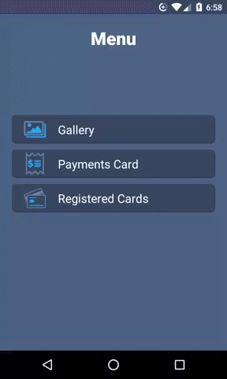
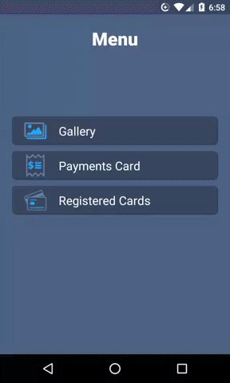
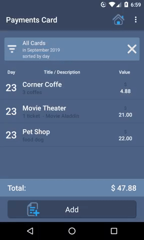
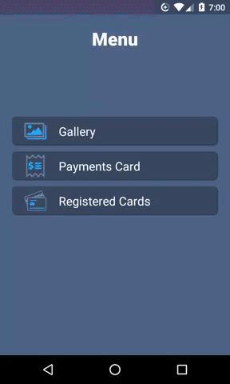

# MUnote

MUnote is a simple, easy-to-use App that lets you keep track of your credit or debit card spend, keep voucher images in low resolution so you don't have to take up any space on your device and always have those vouchers handy. Make part of your financial life easier with MUnote. It can be used offline, as both images and all information are saved only on your mobile phone. After registering new payments they will be separated by payments by Credit, Debit and Both of the corresponding month, being able to view the details of the voucher, edit it or delete it. For greater control you can view vouchers from previous months or years. First steps for use.

1. Register a new credit / debit card.

2. Check if it is credit, debit or both.

3. On vouchers add the expense you had with the card.

4. The title, value, card and date fields are required.

New paid account management and control tools coming soon.

## Getting Started
#####Using Git Bash
```
git clone git@github.com:MurilloComino/android-munote.git
```

#### Using Android Studio
```
in File > New > Project from Version Control... > git

in URL put: https://github.com/MurilloComino/android-munote.git

and then clone
```

## Installing
* Connect via usb your android phone.
* After cloning the project, open the terminal and navigate to the root folder.

#### Windows
````
gradlew installDebug
````
#### Linux & MacOS
````
./gradlew installDebug
````

## Example








## Available on Google Play
<div align="center">
<a href="https://play.google.com/store/apps/details?id=com.onimus.munote"  
</div>


## Main methods used
- [SQLiteDatabase](https://developer.android.com/reference/android/database/sqlite/SQLiteDatabase)
- [ListView](https://developer.android.com/reference/android/widget/ListView)
- [Toolbar](https://developer.android.com/reference/android/widget/Toolbar)
- [Runtime Permissions](https://developer.android.com/guide/topics/permissions/overview)
- [AlertDialog](https://developer.android.com/reference/android/app/AlertDialog)
- [AdMob](https://developer.android.com/distribute/best-practices/earn/show-ads-admob)
- [Fragments](https://developer.android.com/reference/android/support/v4/app/Fragment.html)
- [Spinner](https://developer.android.com/reference/android/widget/Spinner)


## Built With

* [Android Studio 3.5](https://developer.android.com/studio) - The IDE used

## License

* [Apache License 2.0](LICENSE.md)